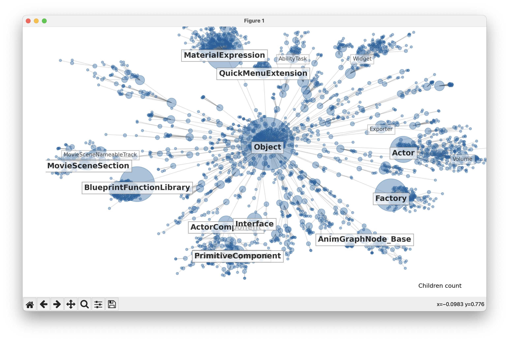

# Visualize classes in Unreal Engine

In the [TAPython documentation](https://www.tacolor.xyz/tapython/learning_unreal_engine_with_python.html), we mentioned [using matplotlib and networkx to classify and visualize UE objects](https://www.tacolor.xyz/tapython/learning_unreal_engine_with_python.html#unreal-python-stub), and this repository is an example of implementing this function.



## Requirements
- matplotlib
- networkx
- scipy

## How to use

0. create a virtual environment and activate it(If you don't want to use virtual environment, you can skip this step.)

1. install the required packages
```shell
pip install -r requirements.txt
```

2. execute the python script main.py


## Note

The data source of visualization is ./PythonStub/unreal.py, which is generated by UE editor. If your UE editor version is different, you can replace unreal.py in the ./PythonStub directory.

How to get unreal.py:

When we enable Developer Mode in Preferences > Plugins > Python and launch the UE editor, a stub file named unreal.py is generated in the <Your_UE_Project>/Intermediate/PythonStub directory. It contains all the Python-available objects and APIs in the current editor. 

## Hotkeys

- The number keys 1-9 on the main keyboard area: switch the title display level
- e/d：switch display mode
- r：reset display layout
- w: draw reference relationship
- q: exit

Other operations such as moving the canvas are the same as matplotlib

Have fun!